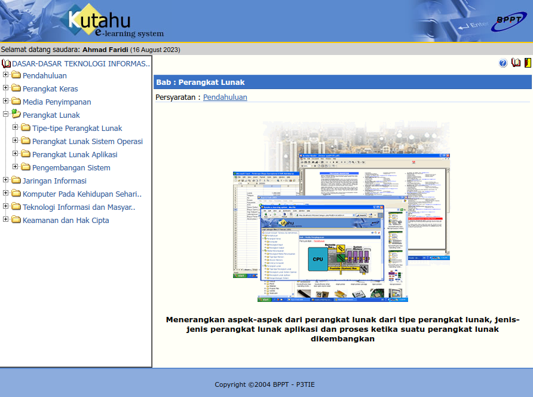
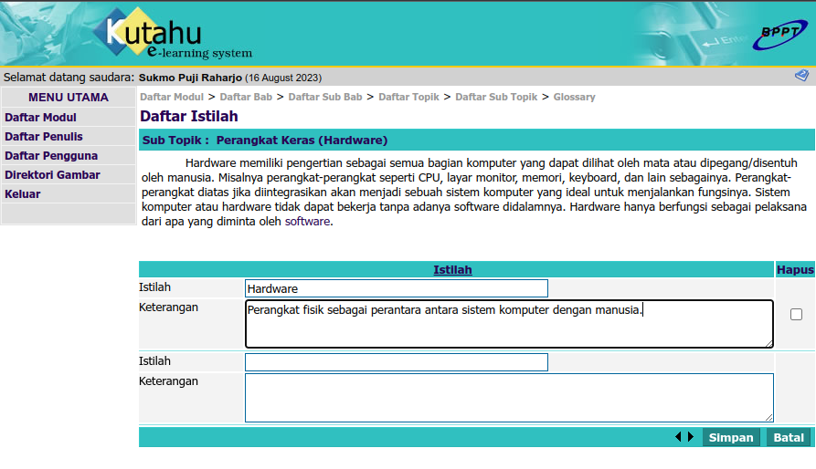

# Kutahu Docker



Ketika saya sedang menggali informasi melalui berbagai sumber (terutama Wayback Machine) mengenai kontribusi Indonesia dalam lanskap Open Source, selain [Kantaya](https://github.com/rbsoen/kantaya-docker) saya menemukan aplikasi web lain yang bernama Kutahu.

**Kutahu**, yang berbasis PHP dan MySQL, adalah aplikasi yang bertujuan untuk menunjang aktivitas belajar jarak jauh atau *e-learning*. Aplikasi ini memungkinkan untuk membaca materi yang terstruktur serta mengerjakan latihan soal. Seperti Kantaya, aplikasi ini dikembangkan oleh P3TIE-BPPT dan dirilis pada 2005.



Dalam sistem Kutahu, materi dibagi menjadi beberapa modul, yang dibagi menjadi bab, yang di dalamnya terdapat sub-bab, yang di dalamnya terdapat topik, yang di dalamnya terdapat sub-topik. Setiap modul, bab, sub-bab, topik dan sub-topik dapat diberi keterangan atau isi yang berformat *rich text*, memungkinkan untuk memasukkan gambar ataupun media lain dalam materi pembelajaran. Sebuah sub-topik juga dapat memiliki daftar istilah yang penting untuk memahami materi pembelajaran.

Latihan soal ditulis sebagai bagian dari sub-bab. Tipe soal yang mungkin hanya berupa pilihan ganda, dan setiap pertanyaan dapat ditampilkan dalam latihan soal modul yang bersangkutan, bab yang bersangkutan, ataupun keduanya.

Pengguna Kutahu dibagi menjadi dua, yaitu pengguna biasa (Pengguna) serta penulis (Penulis). Pengguna hanya dapat membaca materi dalam sistem serta mengerjakan latihan soal. Sementara itu, Penulis hanya dapat menulis materi dan latihan soal di dalam sistem. Adapun khusus Penulis juga dibagi menjadi dua level akses, yaitu Administrator dan Pengajar. Administrator memiliki akses yang sama dengan Pengajar, hanya dengan tambahan dapat mengelola daftar Penulis dan Pengguna serta menentukan apakah seseorang aktif atau tidak. Akses login seorang Pengguna/Penulis tergantung aktif atau tidaknya akun yang bersangkutan.

Sepertinya aplikasi ini dijadikan sebuah bagian dari [serangkaian program yang dikembangkan P3TIE-BPPT](https://www.mail-archive.com/asosiasi-warnet@yahoogroups.com/msg13182.html) bersama dengan Kantaya, Komura (pengelolaan warnet), serta Kasipena (*groupware* seperti Kantaya, untuk kepentingan akademis). Sayangnya, Komura dan Kasipena belum dapat saya temukan arsipnya.

Tidak seperti Kantaya, software ini lebih mudah untuk dibuat untuk berfungsi kembali. Menurut saya, ini dikarenakan kodenya lebih terstruktur serta memang didesain untuk versi PHP dan MySQL yang lebih baru.

## Disclaimer

Software ini cukup jadul dan sepertinya tidak ditemukan versi yang lebih baru. Dengan demikian, software ini dapat memiliki beberapa celah keamanan baik dari sisi kode maupun platform. Oleh karena itu, saya pribadi tidak menyarankan untuk menjalankan software ini untuk hal-hal yang penting - lebih baik mencari alternatif lain yang lebih modern, seperti [Moodle](https://moodle.org).

Proyek ini dimaksudkan untuk melestarikan (preservation) usaha-usaha awal komunitas Open Source di Indonesia.

Folder `Aplikasi` dalam repo ini merupakan versi yang telah diperbaiki untuk digunakan dalam Docker container. Versi asli dari software ini (beserta database MySQL contoh) dapat ditemukan di `software_KuTahu.zip`.

Adapun tambahan signifikan yang saya tambahkan adalah laman `Setup.php` yang secara otomatis muncul apabila tidak dapat melakukan koneksi ke database maupun tabel `kutahu`.

## Setup

Repo ini digunakan dengan `docker-compose`.

Lingkungan yang digunakan adalah MySQL 5.7, PHP 4.4, Apache 2.2 (image yang digunakan: [[3]](https://hub.docker.com/r/nouphet/docker-php4/))

1. Untuk memulai server, ketik `docker-compose up` pada terminal.
2. Setelah container-container telah siap semua, bukalah `http://localhost:8000` dalam browser. Akan muncul laman untuk pengecekan setting.
3. Jika kredensial diubah pada `docker-compose.yml`, ubah `Aplikasi/Common.php` baris 82&ndash;85 hingga sesuai, kemudian mulailah server kembali menggunakan `docker-compose up --build`. Jika sudah sesuai, klik tombol "inisialisasi semua".
4. Tersedia PHPmyadmin untuk saat ini, dapat diakses dengan membuka `http://localhost:8001`.

Untuk membersihkan konfigurasi container, ketik `docker-compose down`. Jika ingin menyertakan volume, tambahkan `-v`. Jika menyertakan *image*, tambahkan pula `--rmi local`

## Lisensi

Software ini diasumsikan berlisensi GPL v2 berdasarkan [pernyataan direktur P3TIE-BPPT](https://www.mail-archive.com/asosiasi-warnet@yahoogroups.com/msg13182.html). Dengan demikian, modifikasi ini berlisensi sama, termasuk perlengkapan Docker-isasinya (`Dockerfile`, `docker-compose.yml`).

```
Hak cipta © 2004 P3TIE-BPPT

Program ini adalah perangkat lunak bebas; Anda dapat menyebarluaskannya
dan/atau memodifikasinya di bawah ketentuan-ketentuan dari GNU General Public
License sebagaimana yang diterbitkan oleh Free Software Foundation; baik versi
2 dari Lisensi tersebut, atau (atas pilihan Anda) versi yang lebih baru.
```

Berdasarkan struktur dan nama fungsi pada kode, kemungkinan kode dibuat menggunakan [CodeCharge Studio](https://www.yessoftware.com/). Karena kodenya merupakan hasil dari *code generator*, legalitas mungkin terpengaruh&mdash;gunakan dengan hati-hati.
